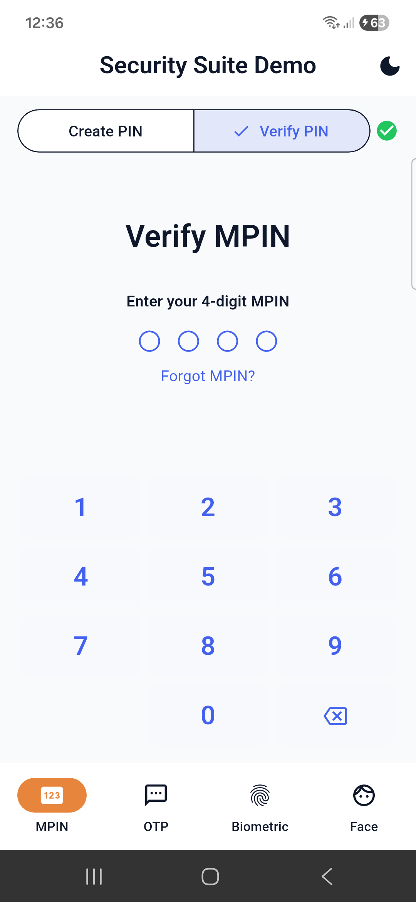
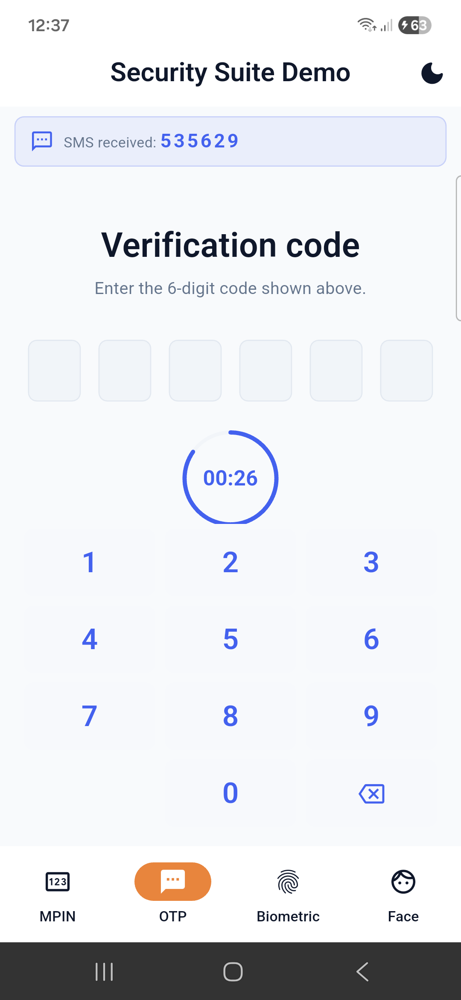
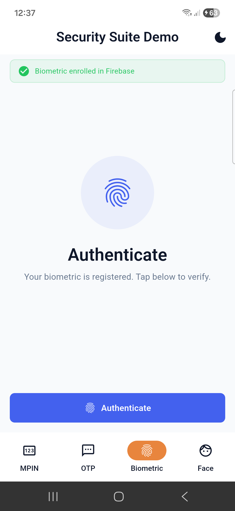
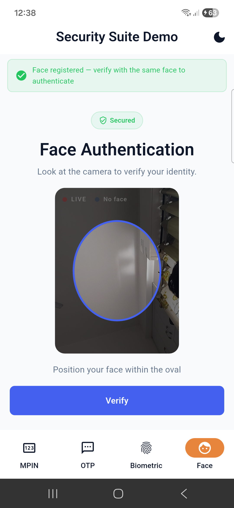

# mobintix_security_suite_demo

Public **sample app** for [**mobintix_security_suite**](https://pub.dev/packages/mobintix_security_suite): run it on a real device to see **MPIN**, **OTP**, **biometric**, and **face** flows with Firebase (Firestore) and [**mobintix_ui_kit**](https://pub.dev/packages/mobintix_ui_kit) theming.

[](https://pub.dev/packages/mobintix_security_suite)
[](https://pub.dev/packages/mobintix_ui_kit)

**Repository:** [github.com/Mobintix-Package/mobintix_security_suite_demo](https://github.com/Mobintix-Package/mobintix_security_suite_demo)

**Report issues or ask questions** about integrating the SDK [here](https://github.com/Mobintix-Package/mobintix_security_suite_demo/issues) (same as the package `issue_tracker` on pub.dev).

---

## Screenshot reference (`screenshots/`)

This repo includes a **`screenshots/`** folder with the same **PNG filenames** as the [**mobintix_security_suite** pub.dev listing](https://pub.dev/packages/mobintix_security_suite): a public visual reference for what you see when you run this demo on a phone (captured from the mobile app, not the web renderer). The table below matches **published** `pubspec.yaml` screenshot entries on pub.dev (package **0.0.1**).

| File | What it shows |
| --- | --- |
| `mpin.png` | MPIN — verify flow with keypad, PIN dots, and Create/Verify toggle |
| `otp.png` | OTP — simulated SMS code, six-digit entry, and countdown timer |
| `biometric.png` | Biometric — fingerprint authenticate screen (enrolled state) |
| `face.png` | Face — live camera preview with oval guide and verify action |

| MPIN | OTP |
|:---:|:---:|
|  |  |

| Biometric | Face |
|:---:|:---:|
|  |  |

**Important:** each filename must match the **screen content** in the table above. Tab order alone is not enough (for example, the OTP tab first shows “Send OTP”; `otp.png` should show **code entry** with the SMS banner and timer, not the MPIN keypad).

**Check:** all four PNGs are present under `screenshots/` and are under pub.dev’s **8 MB** per-file limit for package screenshots.

---

## Packages

### Published app (clone this repo only)

[`pubspec.yaml`](pubspec.yaml) uses **pub.dev** versions (no `path:` dependencies):

| Package | Constraint | Transitive note |
|---------|------------|-----------------|
| [`mobintix_security_suite`](https://pub.dev/packages/mobintix_security_suite) | `^0.0.1` | Pulls in `mobintix_ui_kit` **^0.0.4** per published package |
| [`mobintix_ui_kit`](https://pub.dev/packages/mobintix_ui_kit) | `^0.0.4` | Direct dependency (same major line as the suite) |

**Published metadata (0.0.1):** [Changelog](https://pub.dev/packages/mobintix_security_suite/changelog) · [API docs](https://pub.dev/documentation/mobintix_security_suite/latest/) · published **2026-04-10** on pub.dev.

[`pubspec.lock`](pubspec.lock) in this repo is resolved from **hosted** packages (`source: hosted`, `url: https://pub.dev`) so CI and fresh clones match pub.dev.

```bash
flutter pub get
flutter run
```

### Mobintix monorepo (local SDK changes)

If this folder lives next to `mobintix_ui_kit` and `mobintix_security_suite` source trees, copy overrides so `pub get` uses your local packages:

```bash
cp pubspec_overrides.yaml.example pubspec_overrides.yaml
# Edit paths if your layout differs
flutter pub get
```

`pubspec_overrides.yaml` is **gitignored** so the default clone stays pub.dev-only. **Before committing `pubspec.lock`**, remove or rename `pubspec_overrides.yaml`, run `flutter pub get`, then commit so the lockfile stays **hosted-only** for everyone else.

---

## App structure

```
lib/
├── main.dart                    # Firebase init, theme, bottom navigation
├── firebase_options.dart        # Generated — not committed (see Setup)
├── services/
│   └── firebase_backend.dart    # Firestore CRUD for demo security state
└── screens/
    ├── mpin_demo.dart
    ├── otp_demo.dart
    ├── biometric_demo.dart
    └── face_demo.dart
screenshots/                     # Same PNG names as package pub.dev listing
```

---

## Firestore layout

```
users/{userId}/security/
├── mpin       { hash, created_at }
├── otp        { code, created_at, expires_at, verified }
├── biometric  { enrolled, enrolled_at, last_auth }
└── face       { registered, signature, registered_at, last_auth }
```

Default `userId` is `demo_user` (see `FirebaseBackend`).

---

## Setup

### 1. Firebase project

1. [Firebase Console](https://console.firebase.google.com/) — create a project.
2. Enable **Cloud Firestore** (test mode is fine for local dev).
3. Register Android / iOS / macOS apps as needed.

### 2. Config files

| Platform | File | Location |
|----------|------|----------|
| Android | `google-services.json` | `android/app/` |
| iOS | `GoogleService-Info.plist` | `ios/Runner/` |
| macOS | `GoogleService-Info.plist` | `macos/Runner/` |

### 3. `firebase_options.dart`

Use FlutterFire:

```bash
dart pub global activate flutterfire_cli
flutterfire configure
```

Or copy from a template and fill in values (this file is **gitignored**).

### 4. Run

```bash
flutter pub get
flutter run
```

---

## Features

- **MPIN** — Create / verify PIN (hashed in Firestore).
- **OTP** — Generate and verify a time-limited code.
- **Biometric** — `local_auth` with enrollment state in Firestore.
- **Face** — Camera + ML Kit style flow with live preview (platform-dependent).
- **Theme** — Light/dark via `AppTheme` + `SecuritySuiteTheme` extension (see `demoMaterialTheme` in `main.dart`).

---

## Platform notes

- **Android**: `FlutterFragmentActivity`, camera + biometric permissions in `AndroidManifest.xml`.
- **iOS**: Camera / Face ID usage strings in `Info.plist`.
- **Web / desktop**: Camera and ML Kit support varies; some flows may be limited.

---

## For maintainers: regenerating screenshots

Capture on **Android or iOS device or emulator** (not Chrome/web).

1. Run through each flow so the **on-screen UI** matches the [Screenshot reference](#screenshot-reference-screenshots) table (`mpin.png` = verify MPIN with keypad; `otp.png` = OTP **after** send, with code + timer; `biometric.png` = Biometric tab with **Authenticate**; `face.png` = Face tab with camera + oval).
2. Save or export PNGs with the exact names: `mpin.png`, `otp.png`, `biometric.png`, `face.png`.
3. Replace **`screenshots/`** in **this** demo repo.
4. Copy the same four files into **`mobintix_security_suite/screenshots/`** in the package repo (for `dart pub publish`). Keep **`pubspec.yaml`** `screenshots:` paths unchanged unless you rename files.

Monorepo example:

```text
mobintix-package/
├── Demo/mobintix_security_suite_demo/screenshots/
└── mobintix_security_suite/screenshots/
```

Each file must be **under 8 MB**. See **[doc/PUBLISHING_GUIDE.md](../../mobintix_security_suite/doc/PUBLISHING_GUIDE.md)** §8 in the package repo (or the same file on GitHub in **mobintix_security_suite**).

---

## Security

Firebase config files contain API keys — **do not commit** them. For production:

- [App Check](https://firebase.google.com/docs/app-check)
- Restrict API keys by app/bundle ID
- Tight [Firestore rules](https://firebase.google.com/docs/firestore/security/get-started)
